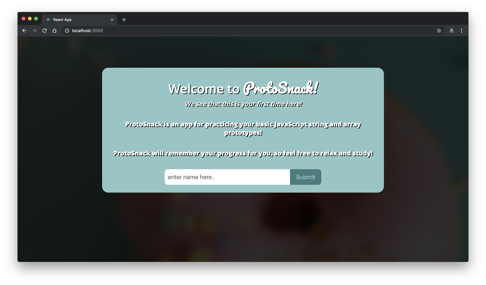
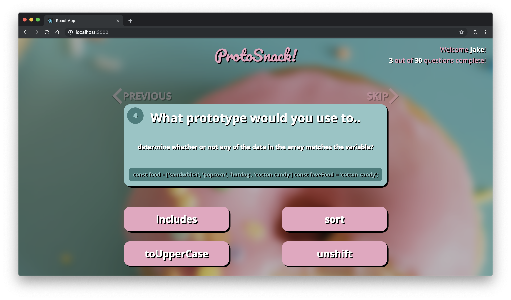
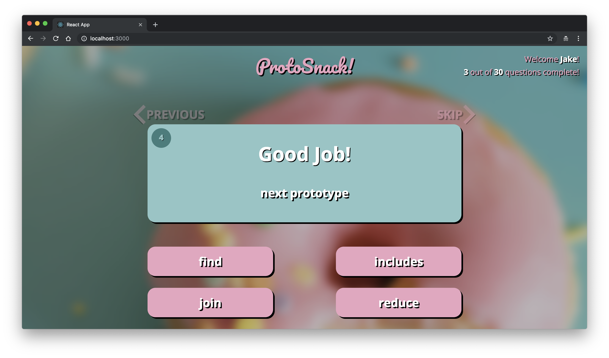

# Memoize -- ProtoSnack
'Memoize' was assigned to be a flashcard style studying app. 

I chose *string and array prototypes* as my topic of study and included a multiple-choice answer system.

You can learn more about the assignment spec by following [this link.](http://frontend.turing.io/projects/memoize.html)

### Contact Info
Credit for the project goes to:
- Jacob Admire: [GitHub](https://github.com/JakeAdmire), 
                [Email](mailto:JakeAdmire1@gmail.com),
                [LinkedIn](https://www.linkedin.com/in/jakeadmire)

#### Design
For the user interface I chose a snack / bakery theme. I had been feeling tired of my history of dark themes and decided to try something new. It was definitely challenging to move outside of my comfort zone and try new things but I do feel stronger for it.
               
### Screenshots of Project
 
 
 
 

### Specific things learned:
I've repeatedly been told that certain lists need keys assigned to them in React. I never understood what this meant until I discovered the code to specifically assign keys to list objects
```
  keys={index}
```
### Challenges faced:
Truly having a grasp of **data-down, actions-up** has been very challenging for me. I originally ended up setting my components up wrong and being unable to pass the correct events that I needed to. After refactoring I feel I have a much better grasp of it.

### Future Implementation Plans
- I ended up having to disable the flashcard 'SKIP' and 'PREVIOUS' buttons due to bugs. I'd like to re-enable them in the future and fix that functionality
- Issues have been made for styling the 'loading' and 'no more cards' pages.
- I'd like to add a reset button after the user completes all the cards.

### Tools Used to Build Project
[Sublime Text Editor](https://www.sublimetext.com/)

[React](https://reactjs.org/)

[Enzyme](https://airbnb.io/enzyme/) & [Jest](https://airbnb.io/enzyme/docs/guides/jest.html)

## Credits
Credit for this project goes to [Jake Admire](https://github.com/JakeAdmire)

---
This project was assigned by Brittany Storoz, Pamela Lovett, and Robbie Jaeger 

*@ Turing School of Software and Design, Denver, CO.*
